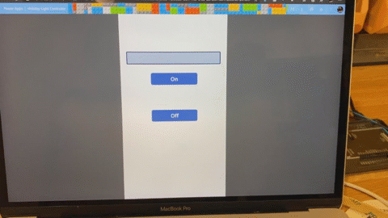

# IoT and Power Platform powered Neopixel Holiday Lights

This repo contains hands on guide showing how to control Neopixel powered holiday lights with Python running on a Raspberry Pi, Azure IoT Central and the Microsoft Power Platform.

## Hardware required

* A Raspberry Pi, SD card and power supply (you can use any Pi that can connect to the internet, so any Pi 3/4 with WiFi, a Pi Zero W, or a Pi Zero with a USB ethernet connection). If you are using a Pi Zero you may want to solder headers on to make it easier to connect the Neopixels.
* Programmable LEDs - anything based on WS2812 or WS2812B such as Neopixels or other programmable LED strip such as [this one](https://www.amazon.com/gp/product/B07FVPN3PH)
* A 5v power supply, either a [USB 2 to terminal block cable](https://www.amazon.com/gp/product/B07QQQZ1DV) or a [DC 5v power supply](https://www.amazon.com/gp/product/B078RXZM4C)
* Appropriate cables depending on the LED strip you have and power supply

## Azure subscription

To work through this guide, you will need an Azure subscription.

### Students

If you are a student aged 18 and up and have an email address from an academic institution, you can sign up for the free Azure for Students offer at [azure.microsoft.com/free/students](https://azure.microsoft.com/free/students/?WT.mc_id=academic-10672-jabenn) without a credit card. At the time of writing this gives you $100 of credit to use over 12 months, as well as free tiers of a number of services for that 12 months. At the end of the 12 months, if you are still a student you can renew and get another $100 in credit and 12 months of free services.

You can also sign up for the [GitHub Student Developer Pack](https://education.github.com/pack?WT.mc_id=academic-10672-jabenn) for a wide range of student software and services, and for there sign up for an Azure for Students account.

### Everyone else

If you are not a student, you can sign up at [azure.microsoft.com/free](https://azure.microsoft.com/free/?WT.mc_id=academic-10672-jabenn). You'll need a credit card for verification purposes only, you'll not be billed unless you decide to upgrade your account to a paid offering. At the time of writing the free account will give you US$200 of free credit to spend on what you like in the first 30 days, 12 months of free services, plus a load of services that have tiers that are always free.

## Power Platform

You will also need a Power Platform account. If you don't have one, you can sign up for a [community plan](https://powerapps.microsoft.com/communityplan/?WT.mc_id=academic-10672-jabenn). This will give you a free environment for learning and building your own apps.

## Steps

1. [Set up the Pi and the NeoPixels](./steps/set-up-neopixels.md)
1. [Set up IoT Central](./steps/set-up-iot-central.md)
1. [Control the Pi from IoT Central](./steps/control-pi-iot-central.md)
1. [Control the lights from a Power App](./steps/set-up-power-app.md)
1. [Clean up](./steps/clean-up.md)
