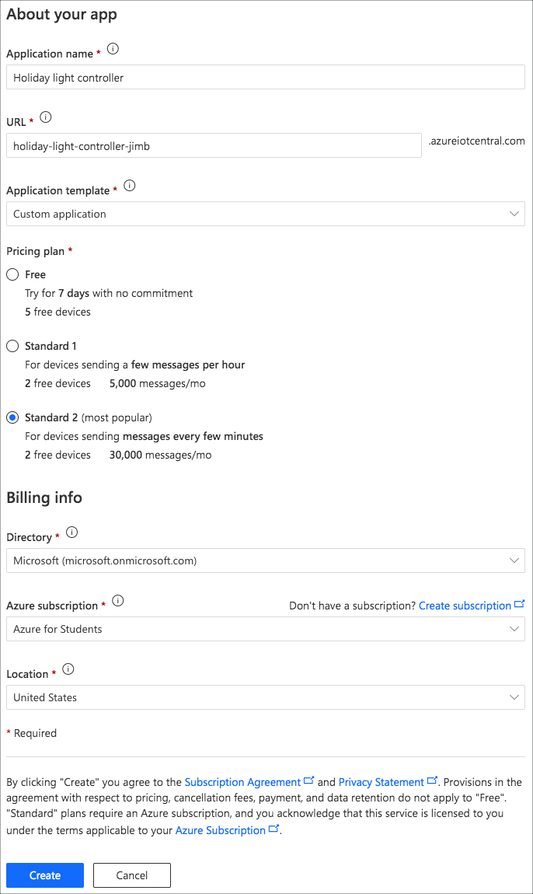

# Set up Azure IoT Central

In the [previous step](./set-up-neopixels) you set up your Pi and NeoPixels, lighting them up to verify that everything is working.

In this step you will set up Azure IoT Central to control the lights.

## Azure IoT Central

Azure IoT Central is a software-as-a-service platform for IoT, allowing you to create IoT applications with no code, except what is needed on the device. It supports up to 2 devices for free, so there is no cloud cost to this app.

IoT Central can be set up to control the Pi allowing remote control of the Neopixels.

> You can learn more about IoT Central via Microsoft Learn, a hands-on, self-guided learning platform from Microsoft.
>
> [Develop IoT Central applications with IoT Central](https://docs.microsoft.com/learn/paths/develop-iot-solutions-with-azure-iot-central/)

### Create an Azure IoT Central app

1. Head to [apps.azureiotcentral.com/](https://apps.azureiotcentral.com/?WT.mc_id=academic-10672-jabenn). Sign in if necessary

1. Select the **Build** tab from the side menu

1. Select the **Custom apps** button

1. Give your application a name, such as `Holiday light controller`

1. Set the URL. This needs to be something unique, so add something like your name or date to it if you can't think of a unique URL

1. Leave the *Application template** as `Custom application`

1. Select the pricing plan. It doesn't matter which one you select as they are all free for up to 2 devices, except for the free plan which is free for up to 5 devices, but your app is deleted after 7 days. If you want your app to last more than 7 days, select the **Standard 1** or **Standard 2** tier.

1. If you are using one of the Standard tiers, select you Azure subscription and the location nearest to you

1. Select **Create**

    

### Create a device template

IoT Cental applications need device templates to define how a device can communicate. Every device needs to be assigned to a device template.

1. From the IoT Central side bar menu, select **Device templates**

1. Select **New**

1. Select **IoT Device** then **Next: customize**

1. Name the device template `Light controller`, then select **Next: Review**, then select **Create**

1. In the *Create a capability model* section, select **Custom**

1. Select **+ Add interface**, then **Custom**

1. Select **Add capability**

1. Add a capability with the following settings:

    | Display Name | Name | Capability Type | Request | Request Display Name | Request Name | Request Schema |
    | ------------ | ---- | --------------- | ------- | -------------------- | ------------ | -------------- |
    | On           | On   | Command         | On      | Color                | Color        | String         |

    Leave all the other fields as their default values. This is a command that can be run to turn the Neopixels on to a specified color.

    The color will be given as a string value representing a Hex string. It will be 6 characters long, with 2 characters each representing the R, G and B values with values from 0-255 (00-FF). For example, red is FF0000, green is 00FF00, blue is 0000FF, yellow is FFFF00, white is FFFFFF.

1. Add another capability with the following settings:

    | Display Name | Name | Capability Type | Request |
    | ------------ | ---- | --------------- | ------- |
    | Off          | Off  | Command         | Off     |

    Again, leave all the other fields as their default values. This is a command that can be run to turn the Neopixels off.

1. Add one final capability with the following settings:

    | Display Name | Name  | Capability Type | Schema  | Writable |
    | ------------ | ----- | --------------- | ------- | -------- |
    | Color        | Color | Property        | String  | On       |

    This is a property to persist the selected color for the Neopixel, so if the Pi restarts it can sync the latest color.

1. Select **Save** from the capability menu, then **Publish** from the top menu, then select the **Publish** button.

### Create a device

Before a device can connect to IoT Central, it needs to be defined so that it has permissions to connect.

1. Select **Devices** from the side bar menu

1. Select the *Light controller* device template from the list

1. Select the **New** button

1. In the dialog, ensure the *Device template* is set to `Light controller`. Name the device `Neopixel` and set the device id to `neopixel`. Then select **Create**.

1. Once the device is created, select it from the list. Select the **Connect** button and take a copy of the *ID scope*, *Device ID* and *Primary key* values.

## Next steps

In this step you set up Azure IoT Central to control the lights.

In the [next step](./control-pi-iot-central.md) you will add code to the Pi to respond to commands from IoT Central to control the lights.
