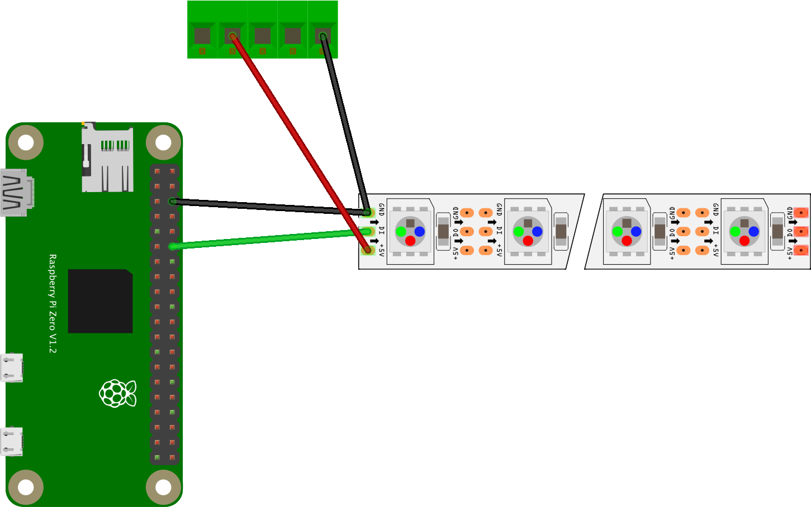
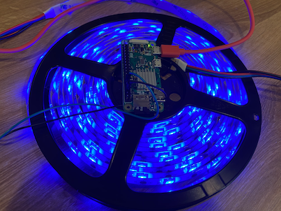

# Set up the Pi and the Neopixels

In this step you will set up your Pi and NeoPixels, lighting them up to verify that everything is working.

## Wire the Neopixels

Neopixels run off 5V of power. In theory they can be powered by a Pi, but the power draw for more than a few pixels will fry the Pi, so it is better to power them separately.

Neopixels may have 3 or 5 leads connected, or a 3 pin socket. 3 leads means one control wire, one positive and one ground. 5 leads means one control wire, two positive and two ground. A 3 pin socket means one control pin, one positive and one ground.

Connect the positive pin/wire and negative pin/wire to a 5v power supply, such as a USB to terminal block adapter. The block has 5 terminals labelled **S + D+ D- -**. Connect the positive wire to **+**, and the negative wire to **-**.

Connect the control wire to GPIO pin 18 on the Raspberry Pi. You can find the position of the pins in the [Raspberry Pi GPIO documentation](https://www.raspberrypi.org/documentation/usage/gpio/), and pin 18 is the 6th pin from the SD card side of the Pi, on the outside.

Finally connect the second negative wire, or connect a second wire to the existing wire/pin, to one of the GPIO GND pins, such as the 3rd pin from the SD card side of the Pi on the outside.



## Configure the Pi

Start by setting up your Raspberry Pi with a clean version of Raspberry Pi OS. The lite version will work fine for this if you want to make your Pi boot faster.

1. Once you have installed Raspberry Pi OS, boot the Pi and ensure it is connected to the internet and updated. You can read more about setting up a Pi without keyboard/mouse/monitor in the [Microsoft Raspberry Pi Resources headless setup guide](https://github.com/microsoft/rpi-resources/tree/master/headless-setup).

1. To update your Pi, run the following command either in the terminal on the Pi (if you are using full Raspberry Pi OS), or via ssh:

    ```sh
    sudo apt update && sudo apt upgrade --yes && sudo reboot
    ```

    This will update the Pi and reboot it.

## Code the Pi

Once the Pi has rebooted, you will need to install some Python packages and write some code to test the Neopixels. Use your favorite tool to do this, though I personally recommend using [Visual Studio Code](https://code.visualstudio.com/?WT.mc_id=academic-10672-jabenn), a free, open source developer text editor that has extensions for a variety of languages, including the [PyLance extension for Python](https://devblogs.microsoft.com/python/announcing-pylance-fast-feature-rich-language-support-for-python-in-visual-studio-code/?WT.mc_id=academic-10672-jabenn). If you are using the full version of Raspberry Pi OS, you can [install VS Code locally](https://www.jimbobbennett.io/run-visual-studio-code-on-a-raspberry-pi/), otherwise use the [Remote SSH extension](https://code.visualstudio.com/docs/remote/ssh?WT.mc_id=academic-10672-jabenn) to code remotely on a Pi 3 or 4, or the [SSH File system extension](https://marketplace.visualstudio.com/items?itemName=Kelvin.vscode-sshfs&WT.mc_id=academic-10672-jabenn) to code remotely on a Pi Zero.

1. Run the following command either in the terminal on the Pi (if you are using full Raspberry Pi OS), or via ssh to ensure pip is installed:

    ```sh
    sudo apt install python3-pip --yes
    ```

1. Create a folder for your app

1. In this folder, create a file called `requirements.txt` and add the following to this file:

    ```sh
    rpi_ws281x
    adafruit-circuitpython-neopixel
    ```

    This file lists the pip packages needed by this app to control the Neopixels.

1. Run the following command to install the relevant pip packages from the `requirements.txt` file:

    ```sh
    sudo pip3 install -r requirements.txt
    ```

    This will install the `rpi_ws281x` and `adafruit-circuitpython-neopixel` pip packages as `sudo`. These packages need to be installed this way because controlling the Neopixels needs to be done as a super user.

1. Create a new Python file called `app.py` in whatever folder you want to use.

1. Add the following code to this file:

    ```python
    import board
    import neopixel

    # Define the NeoPixel strip setting:
    # The pin the control wire is connected to (18 in this code)
    # The length of the strip (150 LEDs in this code)
    # The brightness (0.2 on a scale of 0-1)
    # If the colors are written as soon as the values are updated, or if they need to be
    # updated all at once as soon as the values are set
    pixels = neopixel.NeoPixel(board.D18, 150, brightness=0.2, auto_write=False)

    # Pixel values are made of 3 components - red, green and blue.
    # These values are from 0 (off) to 255 (full on). Colors can be made using different
    # combinations of values. For example, 255, 0, 0 is red, 255, 0, 255 is purple.
    # Set all the pixels to blue
    pixels.fill((0, 0, 255))

    # Show the color on all the pixels
    pixels.show()
    ```

    You can find this code in the [`app.py`](../code/neopixel/app.py) file in the [`code/neopixel`](../code/neopixel) folder.

    Read the code and the comments to see what it does. It creates an object for the Neopixels and sets them all to blue.

    The line:

    ```python
    pixels = neopixel.NeoPixel(board.D18, 150, brightness=0.2, auto_write=False)
    ```

    sets up a string of 150 neopixels. If you have a different length strip, change the value of `150` to the number of LEDs in your strip.

1. Run the following command to run this code:

    ```sh
    sudo python3 app.py
    ```

    The Neopixels will light up blue.

    

## Next steps

In this step you set up your Pi and NeoPixels, lighting them up to verify that everything is working.

In the [next step](./set-up-iot-central.md) you will set up Azure IoT Central to control the lights.
