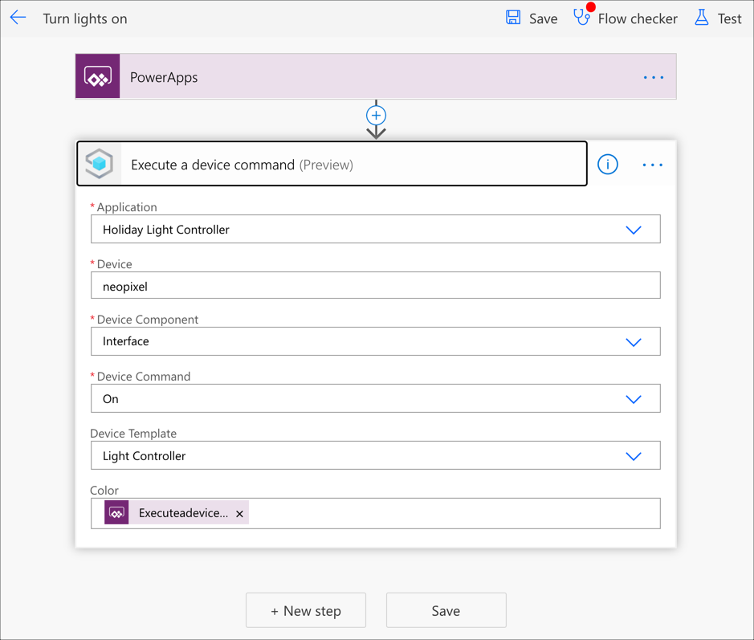
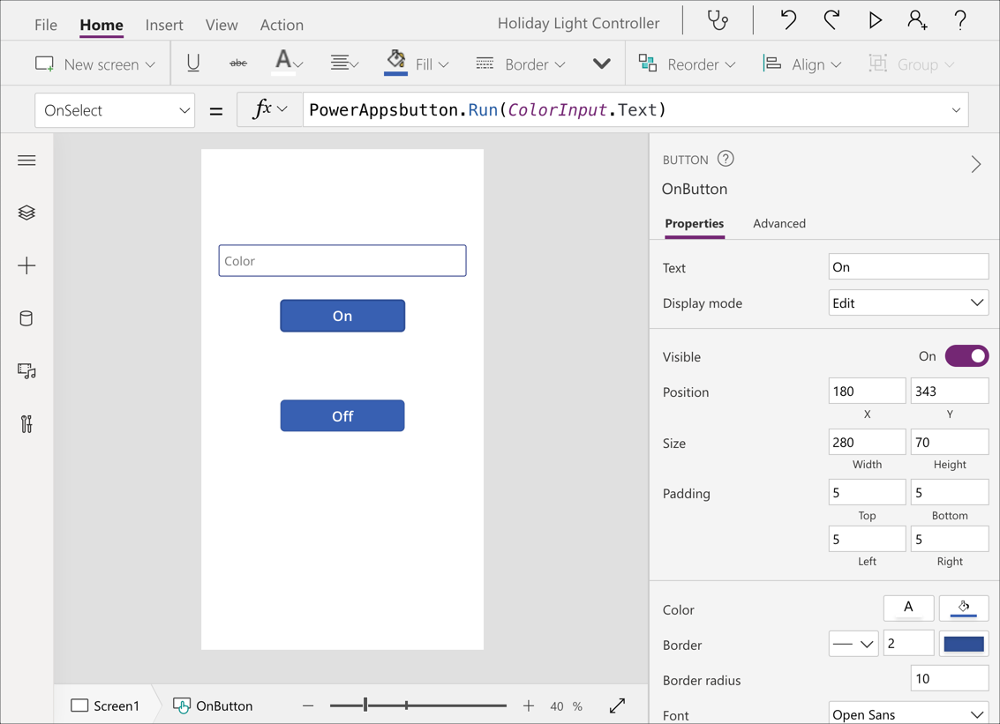

# Control the lights from a Power App

In the [previous step](./control-pi-iot-central.md) you added code to the Pi to respond to commands from IoT Central to control the lights.

In this step you will create a Power App to control the lights from a mobile device or web browser.

## Power Apps

Power apps allow you to create apps with low code or no code by designing apps with a drag and drop designer, and adding Power Automate flows that connect different code or service components.

In this case, there is a connector for Azure IoT Central that allows you to execute IoT Central commands from a Power App flow, and this can be connected to buttons that can be deployed to the Power Apps mobile app or web app.

> You can learn more about the Microsoft Power Platform via Microsoft Learn, a hands-on, self-guided learning platform from Microsoft.
>
> [Microsoft Power Platform Fundamentals](https://docs.microsoft.com/learn/paths/power-plat-fundamentals/?WT.mc_id=academic-10672-jabenn)

## Create the Power App

To create the Power App, you first need to create the Power Automate flows to connect to IoT Central, then design the app on a canvas to use these flows.

### Create Power Automate flows to control IoT Central

You will need a Power Platform account to create an app. If you don't have one, you can sign up for a [community plan](https://powerapps.microsoft.com/communityplan/?WT.mc_id=academic-10672-jabenn). This will give you a free environment for learning and building your own apps.

1. Open the [Power Apps portal](https://powerapps.microsoft.com/?WT.mc_id=academic-10672-jabenn) and sign in

1. Select **Flows** from the side bar menu

1. Select **New**, then select **Create from template**

1. Select **Power Apps button**

1. In the designer, select **New step**

1. Search for `IoT Central` and select the `Azure IoT Central V3` connector (**not** the V2 connector), then select **Execute a device command**

1. Drop down the *Application* box and select your IoT Central application. Set the *Device id* to `neopixel`. Drop down the *Device template* box and select the `Light Controller` device template. From the *Device Component* box, select `Interface`, then from the *Device Command* box select `On`.

1. Once the *On* command has been selected, a new box will appear for the command parameter called *Color*. Select this box, and select **Ask in Power Apps* from the box that appears.

1. Select the *Power apps button* flow name, and edit it to `Turn lights on`

1. Select the **Save** button

    

1. To test the flow, select the **Test** button on the top menu. Make sure *I'll perform the trigger action* is selected, then select the **Test** button. Type a color into the *Executeadevicecommand_Color* box and select the **Run flow** button.

    If everything is working you should see the Neopixels change color.

1. Repeat the above steps with the *Off* command, naming the flow `Turn lights off`. There isn't a parameter for this command.

### Design the Power App

Once the flows are created, the Power App can be designed and connected to them.

1. From the Power Apps side bar, select  **Apps**

1. Select **New App** then **Canvas**

1. From the *Create an app* portal, select **Phone Layout** from the *Blank App* section

1. From the side bar menu, select **Insert**. Select **Button** twice to add 2 buttons, then select **Text input** to add a text input box.

1. Line up the controls on the canvas with the Text Input at the top and the two buttons below

1. Select the Text Input and edit the name from `TextInput` to `ColorInput`. Then update the following properties:

    | Property       | Value |
    | ============== | ===== |
    | Default        |       |
    | Hint text      | Color |
    | Maximum length | 6     |

1. Select the first button below the Text Input and name it `OnButton`. Then update the following properties:

    | Property | Value |
    | ======== | ===== |
    | Text     | On    |

1. With the `OnButton` still selected, select the **Action** tab on the ribbon, then select **Power Automate**. From the popup, select the *Turn lights on* flow. It will take a few seconds to add the flow.

1. The function bar at the top will show the following:

    ```sh
    PowerAppsbutton.Run(
    ```

    This is the command to run the flow, but it is waiting for an input to be passed to it - in this case the color to pass to the command. Complete the function by passing the `Text` property of the `ColorInput` control into it:

    ```sh
    PowerAppsbutton.Run(ColorInput.Text)
    ```

1. Select the second button and name it `OffButton`. Then update the following properties:

    | Property | Value |
    | ======== | ===== |
    | Text     | Off   |

1. Repeat the steps above to connect it to a flow, this time selecting the *Turn lights off* flow.

1. This function doesn't need a parameter to be passed in, so just close the brackets in the function call:

    ```sh
    PowerAppsbutton.Run()
    ```

1. Select the **File** tab from the ribbon. Select **Save**, enter a name for your app such as `Light Controller` then select the **Save** button.



## Test the app

Once the app is created, test it out. Make sure the app is running on the Pi.

1. Select the *Preview the app* button from the toolbar (the play symbol)

1. The app will launch full screen, so enter colors and select the **On** button to turn the Neopixels on, and the **Off** button to turn then off.

Once you are happy with the app, you can run it on your phone. Install the **Power Apps** app from the Apple App Store or Google Play Store, log in, select your app and use it.

## Next steps

Your app is not complete and you can use a Power App and Azure IoT Central to control Neopixels connected to a Raspberry Pi.

You can learn more about Azure IoT Central and the Microsoft Power Platform via Microsoft Learn, a hands-on, self-guided learning platform from Microsoft.

* [Develop IoT Central applications with IoT Central](https://docs.microsoft.com/learn/paths/develop-iot-solutions-with-azure-iot-central/?WT.mc_id=academic-10672-jabenn)
* [Microsoft Power Platform Fundamentals](https://docs.microsoft.com/learn/paths/power-plat-fundamentals/?WT.mc_id=academic-10672-jabenn)
